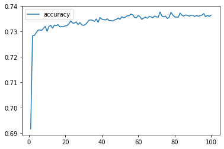
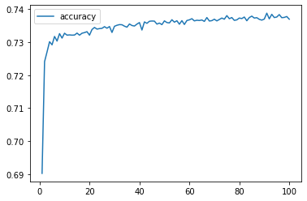
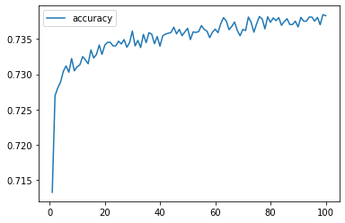

### 21. deep-learning-challenge 
# Charity Funding Predictor

## Overview
### The goal of this project is to create an algorithm using machine learning and neural networks to predict whether applicants will be successful if funded by the fictional non-profit foundation, Alphabet Soup.
----------------------------
----------------------------

## Process
I was given a CSV file that I read into Pandas. This file contained more than 34,000 organizations that have received funding from the fictional foundation along with several columns of metadata about each organization.

PREPROCESSING 
I preprocessed the data by:
* dropping non-beneficial columns,
* finding the number of data points for each unique value for each of the columns that had more than 10 unique values - APPLICATION_TYPE and CLASSIFICATION,
* choosing a cutoff point of 600 and 300, respectively, to bin rare categorical values together into a new value called "Other",
* using `pd.get_dummies()` to convert categorical data to numeric,
* dividing the data into a target array (IS_SUCCESSFUL) and features arrays,
* applying the `train_test_split` to create a testing and a training dataset,
* and finally, using `StandardScaler` to scale the training and testing sets

The resulting data included 44 features. The target variable (y) was IS_SUCCESSFUL. The data was split into training and test subsets.

COMPILING, TRAINING, AND EVALUATING THE MODEL 
The model was required to achieve a target predictive accuracy higher than 75%. I made three official attempts using machine learning and neural networks. They all resulted in the same accuracy rate – right around 72%, so a little short of the required target accuracy.

Results from each model attempt are detailed below:

ATTEMPT 1 
The first attempt (Models/AlphabetSoupCharity1.h5) resulted in an <b>accuracy score of 72.8%. This was the highest accuracy score of the three models.</b> This means that 72.8% of the model’s predicted values align with the dataset’s true values.

The hyperparameters used were:
* layers = 2
  * layer1 = 9 neurons : activation function = ‘relu’
  * layer2 = 18 neurons : activation function = ‘relu'
* epochs = 100

ATTEMPT 2 
For my second attempt (Models/AlphabetSoupCharity2.h5) I added another layer. This attempt resulted in an <b>accuracy score of 72.6%.</b> This means that 72.6% of the model’s predicted values align with the dataset’s true values.

The hyperparameters used were:
* layers = 3
  * layer1 = 9 neurons : activation function = ‘relu’
  * layer2 = 18 neurons : activation function = ‘relu’
  * layer3 = 27 neurons : activation function = ‘relu’
* epochs = 100

ATTEMPT 3 
For my third and final attempt (Resources/AlphabetSoupCharity3.h5) I kept the third layer and changed the activation function for layers 2 and 3. This attempt resulted in an <b>accuracy score of 72.7%.</b> This means that 72.7% of the model’s predicted values align with the dataset’s true values.

The hyperparameters used were:
* layers = 3
  * layer1 = 9 neurons : activation function = ‘relu’
  * layer2 = 18 neurons : activation function = ‘tanh’
  * layer3 = 27 neurons : activation function = ‘tanh’
* epochs = 100

## Summary
In the three attempts I made, the model was unable to achieve a target predictive accuracy higher than 72.8%. Hypertuning resulted in virtually no improvement. I would consider using another classification model to see if it is better at predicting whether applicants will be successful if funded by Alphabet Soup.

## My Code
* VSCode: CharityFundingPredictor.ipynb